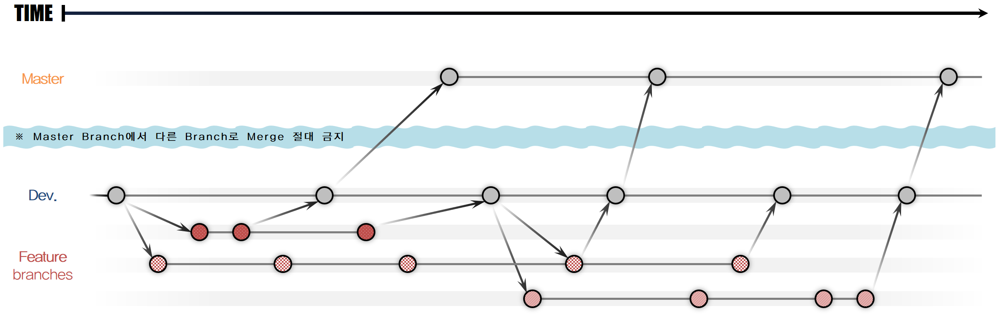

# Git Flow - 브랜치 활용 전략
## Introduce
##### Branch는 "분기"를 뜻한다.
이 문서에서는 활용하게 될 **브랜치의 종류와 역할을 정의**하고, **브랜치 활용 규칙**을 명시한다.  
또한 각 개발 단계/상황에 따른 올바른 브랜치의 선택과 활용 전략을 이해하기 위한 목적으로 작성되었다.

## Overview of the "Git Flow"
  
우리가 활용할 전략의 전체적인 흐름도이다. 최대한 단순한 모습으로 그려봤다.

## 브랜치 소개
### Dev. (= Develop)

- 가장 중심이 되는 브랜치
- 새로운 기능들, 배포 이전 단계의 코드가 관리되는 브랜치
- 새로운 기능과 개선사항, 결함 해결이 **반영**되는 브랜치
- 기본적으로 개발자는 이 브랜치에서 새로운 Feature 브랜치를 생성하여 작업 하게 된다.
- 생명 주기 : 프로그램의 시작~ ~~프로젝트/프로그램이 망하기 전까지는...~~

### Feature

- 개발 및 각종 개선, 결함 해결을 위한 브랜치.
- Dev. 브랜치의 **특정 시점**에서 소스코드를 그대로 **복사**하여 생성된 브랜치.
- **개발자의 자유도가 보장**됨. ~~(*내가 만든 브랜치에서는 어떤 짓을 하든, 어떤 똥을 싸든 Dev.로 Merge or Rebase만 하지 않는다면 다른 브랜치에는 영향을 미치지 않으니 맘껏 개발할 수 있다!*)~~
- 생명 주기 : 주로 개발 단위(이슈, 기능 등). 더이상 필요 없는 경우 삭제됨.

### Master

- 실제 **배포**를 위한 코드가 저장되며, **버전 관리**가 이뤄지는 브랜치
- **다른 브랜치로의 Merge는 엄격히 금지**된다.
- 원래는 hotfix와 같은 특수한 상황이 있지만, 현재는 Dev.에서 계속 버전 업데이트 해주는 방식 채택.
- 생명 주기 : 첫 출시 버전이 생성된 이후~ ~~역시 프로젝트/프로그램이 망하기 전까지~~

## 코드 반영 정책
### 기본 정책
1. 코드 반영 방향 기본적으로 **Feature > Dev. > Master**. (Featrue와 Dev. 사이에서는 조금 다를 수 있는데 아래 참조.)
2. 항상 **Full Merge Request**를 한다. Rebase, 강제 Merge 금지.
3. Merge와 함께 **코드리뷰** 실시.

#### Full Merge Request
- Dev.의 안정성을 해칠 수 있는 **Rebase, 강제 Merge 금지**
- Merge Request를 통해 항상 CI/Pipeline을 거쳐가게 되며, 그 과정에서 Build test, Unit/Regression test 등이 이뤄진다.

#### 코드리뷰
- 코드리뷰를 위해서 Merge Request를 생성할 때 **1명 이상의 Assignee**를 설정.
- 지정된 Assignee 중 1명 이상 코드리뷰를 해야지만 Merge가 이루어짐. (아무리 모든 test가 통과했다고 해도, 리뷰가 끝나지 않으면 소스가 반영되지 않음.)
- Assignee는 최대한 빠르게 코드 리뷰를 진행해주는 것이 매너!
- Assignee가 모든 코드를 ~~물론 보면 좋겠지만~~ 다 볼 수 없기 때문에, Merge Request 생성 시 설명을 최대한 자세히 적어서 수고를 덜어주는 것도 매너!

### 상황별 Merge 전략
#### Direct Merge

- 매우 간편한 방법.
- 현재 작업 중인 브랜치의 변경사항을 Dev.로 바로 Merge 시도.
- Merge 실패 위험이 있음.
    - 파일 충돌 : 현재 브랜치에서 작업한 파일을 다른 개발자가 같은 파일을 작업하고 이미 Dev.에 반영한 경우.
    - Dev. 버전 미호환 : 다른 개발자가 Dev.에 반영한 변경사항에 의해, 기존 소스코드 변경으로 인해 컴파일 되지 않는 현상.
    (파일명/클래스명/변수명 변경 등)

#### Non-Direct Merge

- 조금은 번거롭긴 하지만 안전한 방법.
- 현재 작업 중인 브랜치와 Dev.의 버전을 호환시킨 후 Merge 시도.
    1. 현재 브랜치에 Dev.를 Merge. (Dev. to Feature)
    2. Merge 이후 브랜치의 상태(컴파일, 빌드, 구현 기능 등) 확인. 문제 발생 시 해결
    3. Dev.에 현재 브랜치를 Merge. (Feature to Dev.)

#### Update

- 제품의 배포, 업데이트 등이 이뤄진다.
- Dev.의 변경사항을 Master 브랜치로 Merge. (Dev. to Master)
- 그 시기는 Dev. 브랜치의 개발 진행 단계, 안정화 상태 등이 고려된 적절한 때.
