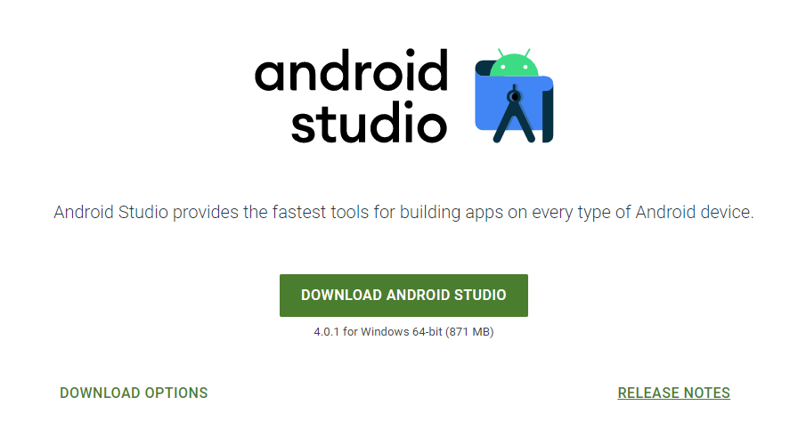
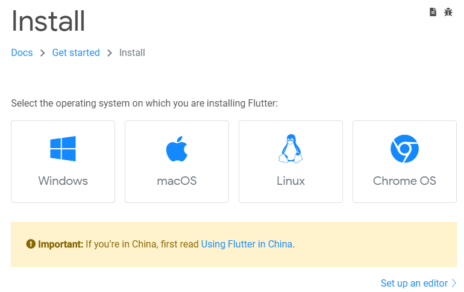
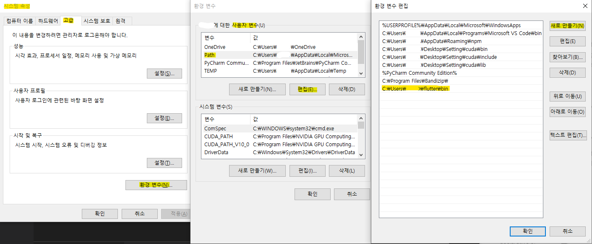
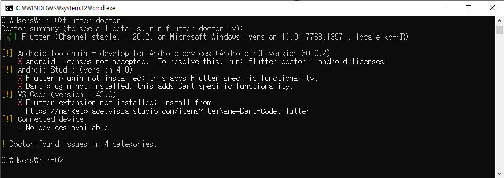
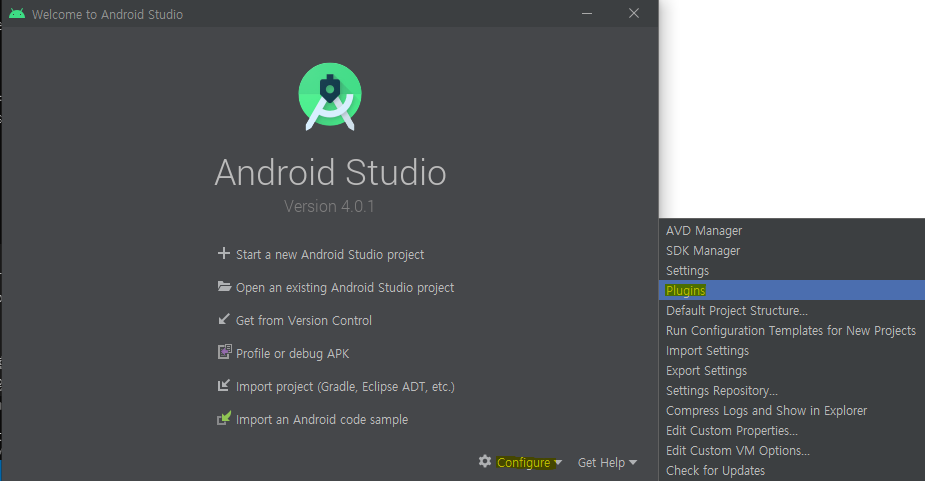
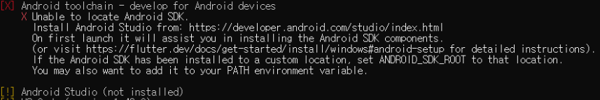
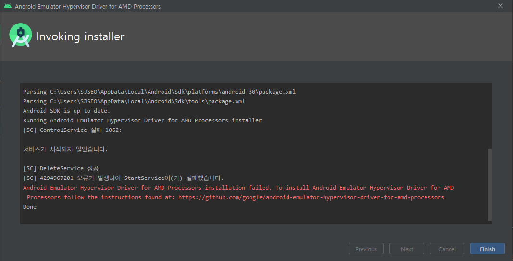
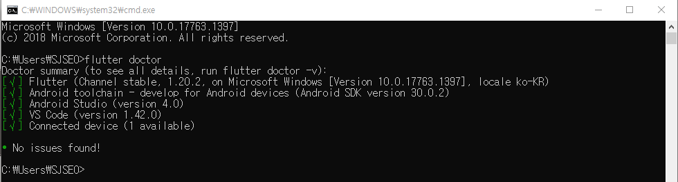

# What is a "Flutter"
##### 참고하면 너무 좋은 글
- [책쓰는 프로그래머 유동 - #1 플러터를 소개합니다](https://brunch.co.kr/@yudong/105)
- [Flutter 개발이야기 - Flutter 앱 개발 후기](https://brunch.co.kr/@tilltue/56)

# How to install the "Flutter"
Windows, AMD 환경에서 Adroid Studio 기반 Flutter 개발환경 구축하기  
##### 참고 링크
- [Flutter 공식 페이지 - Windows 설치](https://flutter.dev/docs/get-started/install/windows)
- [Flutter 입문하기 - 1 설치](https://velog.io/@jisu98/Flutter-%EC%9E%85%EB%AC%B8%ED%95%98%EA%B8%B0-1-%EC%84%A4%EC%B9%98-p4k36p92u5)

## 1. 안드로이드 스튜디오 설치
[Downlaod Android Studio](https://developer.android.com/studio) 링크에 접속해서 다운로드를 진행.
  
본인의 개발 환경에 따라 적절히 변경 후 다운로드하자.
- 내가 설치한 버전 : **4.0.1 for Windows 64-bit**
- 다운로드 창에서는 `C:\Program Files\..` 경로가 기본 설정 되어 있지만, 필자는 이전에 별거 아닌데 경로 때문에 권한 관련해서 엄청 귀찮았던 경험이 있음ㅜㅜ,, 그래서 개발 도구는 웬만하면 `C:\Users\[User ID]\..` 경로에 설치하는 편.

## 2. Flutter SDK 설치
[Downlaod Flutter SDK](https://flutter.dev/docs/get-started/install) 링크에 접속해서 다운로드를 진행.  
  
안드로이드 스튜디오와 마찬가지로 본인의 개발환경에 따라 적절한 SDK kit을 다운로드. ~~중국은 따로 있는게 유우머~~  
다운로드를 완료하면 *적절한 경로*에 압축을 풀어준다.
- 내가 설치한 파일 버전 : **flutter_windows_1.20.2-stable.zip**
- 압축 해제 경로 : 역시 `C:\Users\[User ID]\..` 경로에 바로 압축을 풀었다.

## 3. 시스템 환경 변수 설정
인스톨 형태가 아닌 압축파일 형태의 개발 도구~~거의 대부분의 Develop Kit~~를 설치하는 경우는 사실상 환경 변수 설정에서 대부분의 시간을 잡아먹는다. 당황하지 않고 정확히 추가해줘야 한다.
### 시스템 환경 변수 추가
`설정 > 시스템 환경 변수 편집 > 환경변수(N)`로 들어가자.
  
- `사용자 변수 > Path > 편집(E) > 새로 만들기(N)`를 클릭 및 변수 추가.
- 위에서 압축 푼 Flutter SDK 경로인 `C:\Users\[User ID]\flutter\bin`을 추가했다.

## 4. Flutter doctor
### Flutter doctor 실행
cmd를 실행한 후에 `flutter doctor`를 입력.  
- ~~당연히 알겠지만~~ cmd 실행방법 : **실행**(`윈도우 + E`)에서 `cmd`입력. 혹은 `명령프롬프트` 검색 (Windows 10 기준)
- 아래 사진과 같이 Doctor가 실행되지 않는다면 **3단계에서 환경 변수가 제대로 설정되지 않은 경우.** 다시 설정 필요!

### 상태 해설 & 해결방법
1. Flutter : Flutter 설치 상태. 이 부분이 초록색 체크가 아니라면 분명 이전 단계에서 잘못 설치한 것.
2. Android Tollcahin : **Toolchain** 설정 상태
    - Toolchain 설정 : cmd에 바로 `flutter doctor --android-licenses` 입력
    - 이때 각종 동의여부가 뜨는데 `y` 입력. ~~동의 안하면 못쓰게 할거잖아~~
3. Android :  **Android Studio Plug-in** 설치 상태
    - Android Studio에서 **Flutter/Dart plug-in 설치**한다.  
      
    Android Studio 첫 화면의 `Configure > Plugins`을 누르고 `Flutter`를 검색해서 설치해준다. (**Flutter를 설치하면 Dart도 같이 설치됨.** 이 방법으로 설치하지 않으면 Dart를 따로 설치해줘야 할 수도 있음.)
    - 이때 안드로이드 스튜디오가 아예 설치되지 않은 상태면 아래와 같이 표시 된다. (혹은 설치는 했지만, 한번도 실행하지 않으면 SDK가 설치되지 않음.)  
      
4. VS Code : 확장 프로그램인 **Flutter Extension** 설치 상태
    - `VS Code > Extension` 실행 (`Ctrl+Shift+X`)
    - `flutter` 검색 후 설치. (맨위 Dart Code에서 만든 Flutter)
5. Android Device : **안드로이드 기기** 연결 상태
    - **직접 디바이스를 연결**할 수 있고, 안드로이드 스튜디오에서 **Emulator**를 돌릴 수도 있다.
    - 나는 Emulator를 돌릴것이기 때문에 Android Studio의 `Configure > AVD Manager > Create Virtual Device.`에서 **Galaxy S10**을 만들었다.
    - 참고 페이지 : [안드로이드 AVD(Android Virtual Device)에 갤럭시 S9 스킨 추가 방법 - 안드로이드 스튜디오](https://blog.naver.com/chandong83/221890147009) / [Galaxy S10 emulator profile 만들기](https://medium.com/duckuism/galaxy-s10-emulator-profile-%EB%A7%8C%EB%93%A4%EA%B8%B0-adf6ecf3b8ba)
    - AVD를 생성하기위해 추가설치를 해야한다. 그런데 현재 사용 중인 데스크탑이 **AMD 라이젠** CPU를 사용 중이라 아래와 같은 오류가 발생하며 설치할 수 없었다.  
      
    - 해결하기 위해 참고한 사이트 : [[android] AMD CPU에서 android emulator 설치시 4294967201 오류 해결하기](https://jhleed.tistory.com/184)

## 5. 설치 환경 점검
위에서 표시된 사항들을 모두 해결한 후 cmd 창에 다시 `flutter doctor`를 입력한다.  
아래처럼 모두 체크 표시로 변경되고  
  
**No issues found!** 가 뜬다면 완료! (디바이스를 연결한 상태 or Emulator로 AVD를 실행시킨 상태. 아니라면 디바이스는 초록색 체크가 뜨지 않음.)
